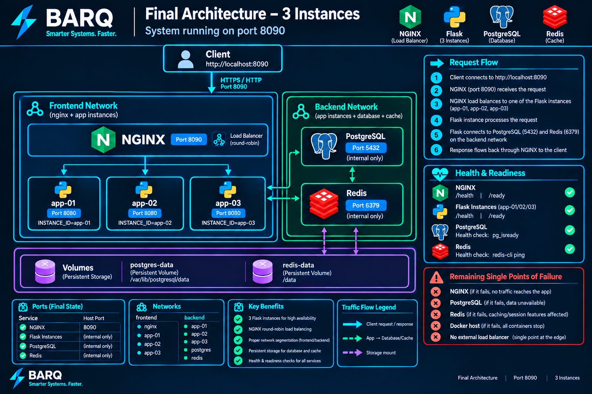

# BARQ DevOps Internship Task - 2026

<p align="center">
	
	
	
	
	
	
</p>

Load-balanced Flask backends behind NGINX, with PostgreSQL and Redis services.
The stack runs as two instances by default (three after the live scale-up).
See
[assessment/TASK.md](assessment/TASK.md) for the task and
[assessment/APPLICATION.md](assessment/APPLICATION.md) for the API contract.

> Public port is **8080** by default. During the recorded video this is
> changed live to **8090**, and a third app instance is added live — see
> `docs/EVIDENCE_INDEX.md` for the exact commit/timestamp of each change.

## Prerequisites

- Linux or WSL2, Docker Desktop/Engine with Compose v2, Python 3.12, Git.
- 2 CPU cores / 4 GB free RAM / 3 GB free disk, plus Docker overhead.

## Setup

```bash
git clone https://github.com/Eng-Omar-Hussein/BARQ-Academy.git
cd BARQ-Academy
cp .env.example .env
```

## Build and start

```bash
docker compose -p barq-assessment up --build -d
docker compose -p barq-assessment ps
```

Wait for every service to report `healthy`, then confirm the stack:

```bash
curl -i http://127.0.0.1:8080/
curl -i http://127.0.0.1:8080/health
curl -i http://127.0.0.1:8080/ready
curl -i http://127.0.0.1:8080/instance
curl -H 'Content-Type: application/json' -d '{"title":"demo"}' http://127.0.0.1:8080/records
curl http://127.0.0.1:8080/records
curl http://127.0.0.1:8080/counter
```

## App-only tests (no Docker/DB required)

```bash
python3 -m venv .venv && source .venv/bin/activate
python -m pip install -r requirements.txt
python -m unittest discover -s tests -v
```

## Validate the full environment

```bash
python validate.py --url http://127.0.0.1:8080
```

Checks public access, every required endpoint, both/all backends answering
through NGINX, PostgreSQL/Redis readiness, and network isolation
(NGINX not on the backend network; PostgreSQL/Redis publish no host ports).
Exits non-zero on any failure.

## Failure / recovery test

```bash
python failure_test.py --url http://127.0.0.1:8080 --target app-02
```

Stops `app-02`, proves traffic keeps flowing through `app-01` with zero
client-visible 5xx, restarts `app-02`, and proves it serves requests again.
Always restarts the target in a `finally` block, even on failure.

## Backup and restore (PostgreSQL persistence proof)

```bash
curl -H 'Content-Type: application/json' -d '{"title":"persistence-check"}' http://127.0.0.1:8080/records
./backup.sh backups                 # writes backups/barq_tasks_<timestamp>.sql, verifies it is non-empty
docker compose -p barq-assessment stop app-01 app-02 postgres
docker compose -p barq-assessment rm -f app-01 app-02 postgres
docker compose -p barq-assessment up -d              # postgres-data volume is NOT removed
curl http://127.0.0.1:8080/records                   # the record survives container recreation
./restore.sh backups/<file>.sql     # drops and reloads the records table, proves row count >= 1
```

## CI

`.github/workflows/ci.yaml` runs on every push and pull request: checkout,
Gitleaks secret scan, Python syntax check, app-only unit tests, shell syntax
check, `docker compose config`, image build, Trivy image scan, stack start,
bounded readiness wait, `validate.py`, `failure_test.py`, `backup.sh`,
`restore.sh`, then teardown. Any failing step fails the run.

## Stop and clean up

```bash
docker compose -p barq-assessment down          # keeps the postgres-data/redis-data volumes
docker compose -p barq-assessment down --volumes  # only when you intend to discard persisted data
```

Avoid global `docker system prune` — it can remove unrelated containers/images.

## Recorded challenge (video only)

`video_challenge.sh` injects one random runtime fault (one-time, per working
copy) once the environment is healthy on the initial two-instance layout.
Run it exactly once, live, during the recording:

```bash
./video_challenge.sh
```

Diagnose and repair the injected fault without `docker compose down`. See
`assessment/TASK.md` and `scripts/video_challenge.py` for the exact
preconditions and safety checks.

## Documentation index

| File | Contents |
|---|---|
| [assessment/TASK.md](assessment/TASK.md) | Original task brief |
| [assessment/APPLICATION.md](assessment/APPLICATION.md) | API contract |
| [troubleshooting.md](troubleshooting.md) | Investigation journal: symptom -> hypothesis -> command -> root cause -> fix -> retest, per issue |
| [log_analysis.md](log_analysis.md) | Reproducible analysis of the three historical logs, with commands, counts, timeline and correlation |
| [decisions.md](decisions.md) | Technical decisions, alternatives, trade-offs, production follow-ups |
| [security_review.md](security_review.md) | Security/production-readiness findings with evidence and verification steps |
| [AI_USAGE.md](AI_USAGE.md) | AI tool usage disclosure |
| [docs/ARCHITECTURE.md](docs/ARCHITECTURE.md) + `architecture.png` | Request flow, ports, networks, storage, health relationships |
| [docs/EVIDENCE_INDEX.md](docs/EVIDENCE_INDEX.md) | Requirement -> file/output -> commit -> video timestamp |

## Answers to the task's questions
 
**What failed first? What proved the cause? Which failed attempt taught you something?**

The first thing *found* was the Dockerfile's leftover `USER root` (Entry 1),
by reading top-to-bottom rather than running anything — `grep -n USER
Dockerfile` proved it directly, since `USER root` was the last `USER`
directive before `CMD`. But the first thing that actually **failed at
runtime**, and blocked verifying almost everything else end-to-end, was
NGINX never receiving traffic at all: every `curl` through the published
port came back `Connection reset by peer` (Entries 3, 4 and 8 in
`troubleshooting.md` all record hitting this same symptom while trying to
retest unrelated fixes). The real root cause was Entry 9 —
`docker-compose.yml` published the host port to container port `81`, while
NGINX listens on `80` — so no request from outside the stack was ever
reaching NGINX's listener at all, regardless of how correct the
upstream/app/network config underneath it was. That's also the most
instructive lesson: the config-review fixes in Entries 1, 2, 3, 5, 6, 7 and 8
were each individually correct but *unverifiable end-to-end* until this one
port-mapping bug was found and fixed, because nothing could reach the stack
in the first place. It's a reminder not to declare a fix "done" from static
inspection alone — each entry's "Remaining uncertainty" note exists
precisely because retesting kept surfacing the same unresolved symptom until
Entry 9 closed it.
 
**What patterns did the logs reveal? How did you avoid double-counting requests?**

Two distinct failure signatures, not one: a dense "connection refused"
cluster (11:05-11:09, every path, zero corresponding `application.log`
entries — the process was never reached) versus a sparser `/records`-only
timeout cluster (11:25-11:26, *with* `application.log` entries — the process
was reached but a dependency call stalled). See `log_analysis.md` section 9
for the rule used to tell them apart. Double-counting was avoided by
treating `request_id` as the single source of truth for "one client
request": 2 truncated/malformed lines were dropped, 5 byte-for-byte
duplicate `access.log` lines (a periodic log-shipper re-flush, landing
exactly every 120 requests) were collapsed to one occurrence each, and the
19 lines where NGINX internally retried against a second upstream were
confirmed to still be a *single* `access.log` line with one `request_id` and
one final client-visible status — so counting distinct `request_id` values
never double-counts a retry as two requests (`log_analysis.md` sections 1-2).
 
**How do requests flow? Why these ports, networks and readiness checks?**

Client -> NGINX on the published host port (8080, later 8090 live) -> one of
the app instances over the `frontend` network -> PostgreSQL/Redis over the
`backend` network, which is `internal: true` and never reachable from NGINX
or the host. NGINX only joins `frontend`; Postgres/Redis only join `backend`
and publish no host ports — that split is what "block direct NGINX access to
PostgreSQL/Redis" and "publish only NGINX on host port 8080" actually mean
in Compose terms, not just a policy statement (`docs/ARCHITECTURE.md`,
`security_review.md` Findings around isolation). `/health` reports process
liveness only (no dependency calls, so a slow DB doesn't fail liveness and
trigger an unnecessary restart); `/ready` checks PostgreSQL and Redis
specifically, because "the process is up" and "the process can actually do
its job" are different questions, and only the second one should gate
receiving real traffic.
 
**Why these timeouts, retries, restart settings and resource limits?**

`proxy_connect_timeout 2s` / `proxy_read_timeout 3s` plus
`proxy_next_upstream_tries 2` bound how long a client waits behind a dead or
hung backend before NGINX tries the other one — long enough to tolerate a
slow-but-alive response, short enough that a dead backend doesn't stall a
request for a client-visible amount of time. Healthcheck `interval`/`retries`
values (3-5s intervals, single-digit retry counts) are sized so a genuinely
crashed container is detected and can be restarted within roughly the same
order of magnitude as the NGINX timeouts above, rather than lagging far
behind them. `restart: unless-stopped` on every service means a crash is
self-healing without also fighting a deliberate `docker compose stop` during
the failure test. Resource limits (`decisions.md`, Decision 6) exist so one
runaway container can't starve the shared host that everything else in this
lab runs on; they're sized for this lab's synthetic load, not validated
against real production traffic.
 
**When should validation fail? What does green CI prove, or not prove?**

`validate.py` should fail — and does — if: the public endpoint never becomes
reachable within its bounded wait, any required endpoint returns the wrong
status/shape, fewer than the expected number of distinct backend
`instance_id`s show up over repeated `/instance` calls, `/ready` isn't 200,
or NGINX/Postgres/Redis violate the required network/port isolation. Green
CI proves: the code compiles, the app-only unit tests pass against fake
dependencies, the Compose file is syntactically valid, the images build and
pass a Trivy scan at HIGH/CRITICAL severity, the *real* stack (real
Postgres, real Redis, real NGINX) starts and becomes ready, `validate.py`
and `failure_test.py` pass against that real stack, and a real
backup/restore round-trip succeeds — all in GitHub's ephemeral runner
environment. It does **not** prove: that the same result holds under real
production traffic/scale, that the third-instance/port-8090 live changes
made only during the video are captured (CI runs against the two-instance,
port-8080 `docker-compose.yml` as committed), or that a human understood
*why* each check passes rather than just satisfying it — that's what the
video and this documentation are for.
 
**Which single points of failure remain? How would you fix them in production?**

Documented on the architecture diagram and in `security_review.md`
(Finding 6) and `decisions.md`: a single NGINX instance (no redundant edge),
single PostgreSQL and single Redis instances (no replica/failover), the
single Docker host everything runs on, and no external load balancer in
front of NGINX. In production: run at least two NGINX replicas behind an
external LB/VIP, add PostgreSQL replication with automated failover (or a
managed HA Postgres), add Redis replication/Sentinel or a managed cluster,
and move off a single host onto an orchestrator (Kubernetes/ECS/Nomad) with
multi-node scheduling.
 
**What would you improve? How did you verify AI-assisted work?**

Concrete follow-ups are listed per-finding in `security_review.md`:
switching `CMD` to gunicorn instead of Flask's dev server, scoping NGINX's
`proxy_next_upstream` away from the mutating `POST /records` endpoint so a
partial failure can't double-write, adding rate limiting at the edge, and
shipping logs to a real aggregator with retention instead of relying on
container stdout. I used AI tools as an assistance layer, not as a substitute 
for verification. I independently reviewed the generated scripts, commands, 
documentation, and diagrams, then tested them in the actual assessment environment. 
I compared their behavior and recommendations against the assessment requirements, 
repository configuration, application logs, and actual service behavior. I modified 
or rejected suggestions when they did not match the observed system. For scripts, 
I ran them and checked their exit codes and outputs; for documentation and diagrams, 
I cross-checked them against the implemented Docker Compose architecture, networking, 
CI/CD configuration, and test results.


## Architecture



